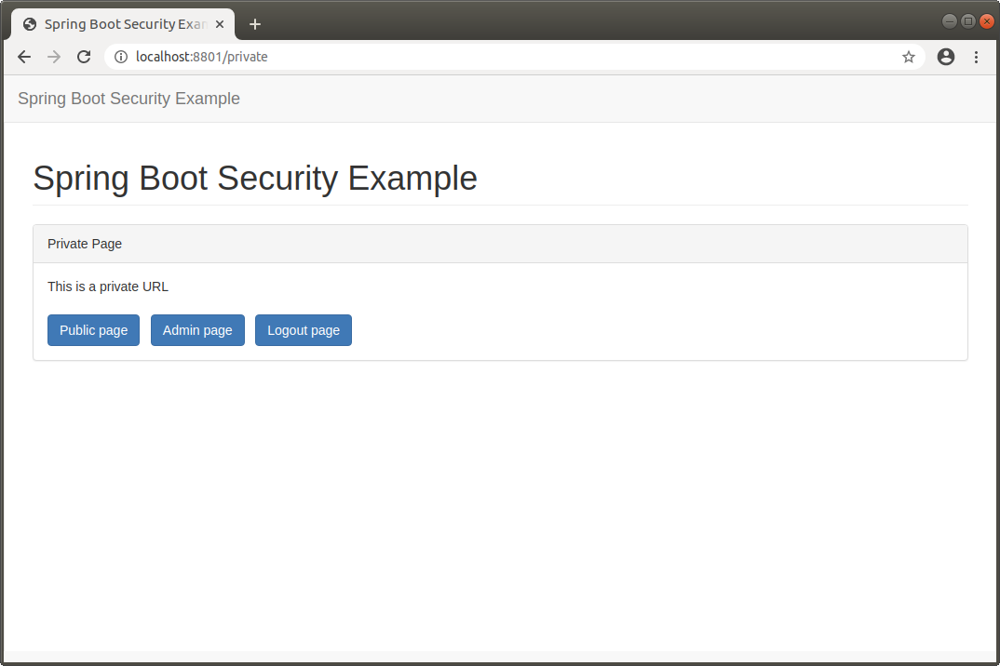
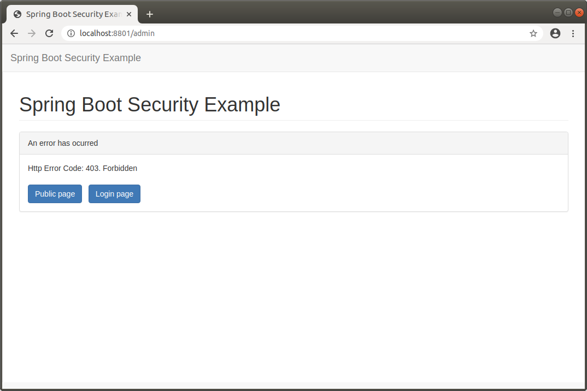
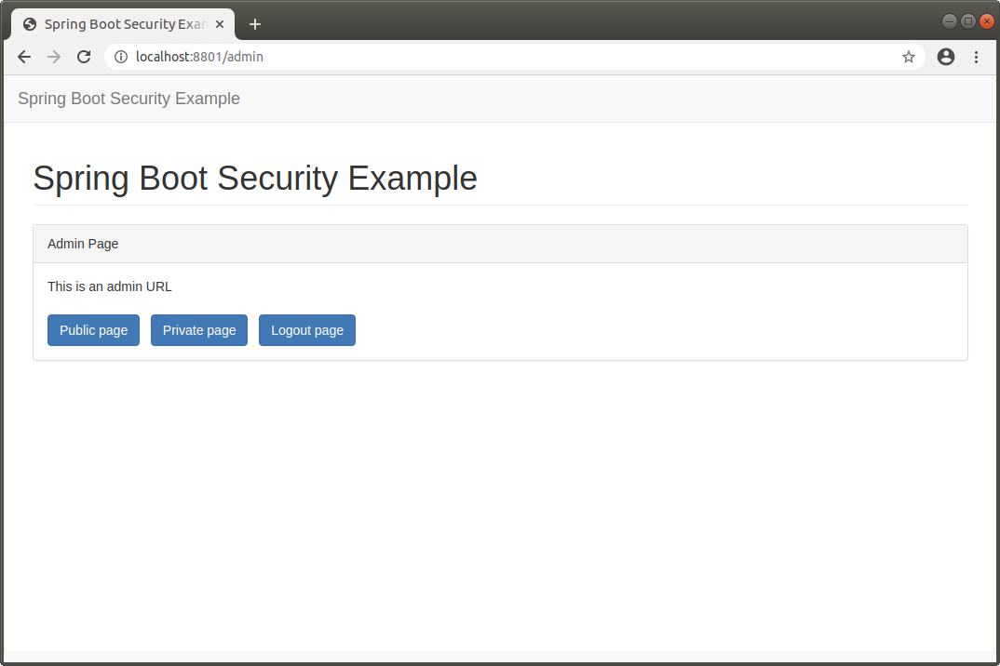

SPRING SECURITY PROJECT
-------------------------------------------------------------------------------------

Proyecto Spring Boot que utiliza Spring Security para autenticar y autorizar el 
acceso a URLs dependiendo de si el usuario ha sido autenticado y de los roles que posee.

La clase SecurityConfiguration define las URLs de acceso público y privado:


```

    @Override
    protected void configure(HttpSecurity http) throws Exception {
        http.authorizeRequests()
                .antMatchers("/", "/init").permitAll()
                .antMatchers("/private").authenticated()
                .antMatchers("/admin").hasRole("ADMIN")
                .and().formLogin().and().logout();
    }

```

-----------------------------------------------------------------------------------

Página de acceso público:


-----------------------------------------------------------------------------------

Página de acceso privado, accesible para usuarios autenticados:



-----------------------------------------------------------------------------------

Página de error, en este caso se arroja error 403, 
por no tener permisos para acceder a la URL solicitada:



-----------------------------------------------------------------------------------

Página de acceso privado, accesible solo para usuarios autenticados que tienen rol "admin":



-----------------------------------------------------------------------------------

